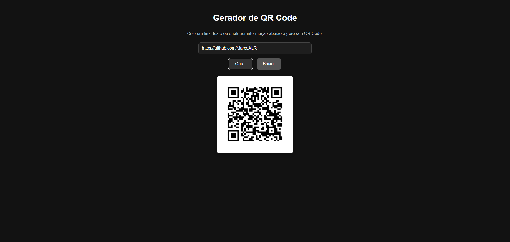

# 🚀 Gerador de QR Code

Aplicativo web simples e rápido para gerar QR Codes online. Cole um link, texto ou qualquer informação e gere um QR Code instantaneamente. Também é possível baixar o QR em formato PNG.

🔗 **Acesse agora:**  
👉 [https://gerador-qr-taupe.vercel.app](https://gerador-qr-taupe.vercel.app)

---

<div align="center">
  
</div>

---

## ✨ Funcionalidades

- ✅ Gerar QR Code a partir de texto, link ou qualquer dado.
- ✅ Download do QR Code em formato PNG.
- ✅ Interface responsiva com tema escuro.
- ✅ Grátis, rápido e direto no navegador.
- ✅ Sem anúncios, sem conta e sem complicação.

---

## 🛠️ Tecnologias Utilizadas

- ⚛️ [React](https://reactjs.org/)
- ⚡ [Vite](https://vitejs.dev/)
- 🖼️ [qrcode.react](https://www.npmjs.com/package/qrcode.react)
- 💅 CSS Puro (Dark Mode)
- ☁️ Hospedado com [Vercel](https://vercel.com/)

---

## 📦 Como rodar localmente
 **Clone o repositório:**

```bash
Clone o repositório:
git clone https://github.com/MarcoALR/GeradorQR.git
Instale as dependências:
npm install
Inicie o servidor local:
npm run dev
Acesse em: http://localhost:5173

📤 Deploy
Este projeto já está publicado em:
👉 https://gerador-qr-taupe.vercel.app

🧠 Créditos
Criado por Marco A. — sinta-se livre para usar, melhorar e compartilhar.
